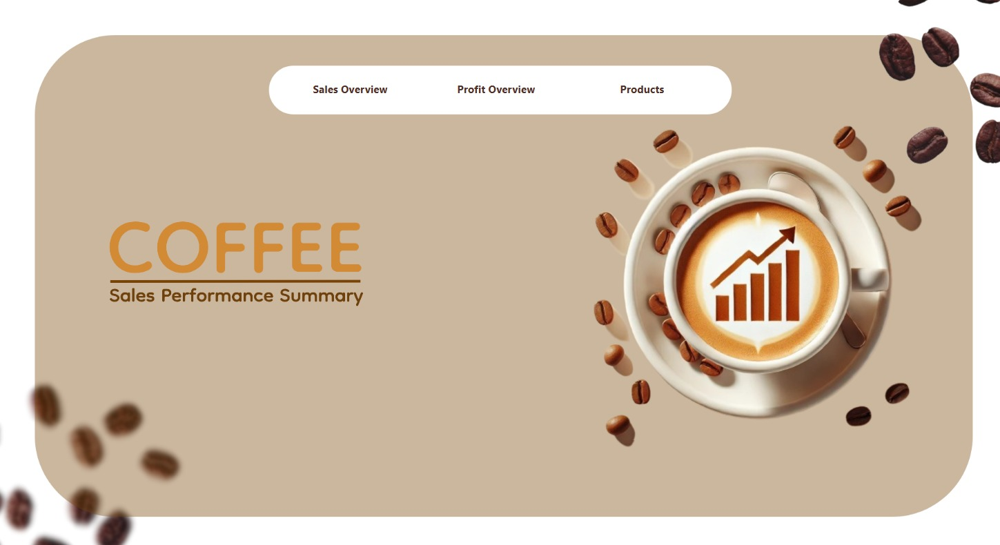

# Coffee_Sales_Analytics
This repository contains interactive Coffee Sales Analytics, offering insights into revenue, profit, product performance, and store location trends. The interactive Power BI report can be found [here](https://app.powerbi.com/view?r=eyJrIjoiYzZjNTgzNTItMzlkMS00NDI3LWJhMzEtZTI0OTBkZTA3M2I0IiwidCI6Ijc1ZGNjYmU1LWRjMTUtNDEwNS1iM2JiLTljZDBlN2E3YTY5MiJ9&pageName=ba4279ef49f196f7b630).

## North Star Metrics and Dimensions  

- **Sales:** Total revenue and profit from coffee-related products across multiple categories.  
- **Product Categories:** Coffee, Tea, Bakery, Drinking Chocolate, Coffee Beans, and other specialty items.  
- **Plan Period:** Monthly and yearly sales trends.  
- **Regions Covered:** Multiple store locations across North America (Lower Manhattan, Astoria, Hell's Kitchen).  
- **Expenditure & Profitability:** Analyzing spending patterns and net profit margins.  
## Dashboard Insights Summary

### Sales Overview  
Focus: Monthly sales trends, store revenue breakdown, and order distribution.

- Total sales amount to $698.812K, with 149.12K orders recorded.
- Sales trends show a steady increase from January to June 2023.
- Revenue Breakdown by Store Location:
  - Sales are evenly distributed across Hell’s Kitchen (32.92%), Astoria (33.84%), and Lower Manhattan (33.23%).
  - All three stores contribute almost equally to total revenue.
- Sales by Store Location:
  - The number of orders is consistent across all store locations.
  - Sales revenue is nearly proportional to the number of orders.

Key Takeaway: Sales are steadily increasing, and all store locations perform similarly in revenue contribution.

---

### Profit Overview  
Focus: Monthly profit trends, product profitability, and expenditure.

- Profit steadily increases from January to June, reaching over **$50K** in June.
- Top profitable categories:
  - Coffee, Tea, and Bakery items generate the highest profit.
  - Coffee and tea contribute the most, aligning with revenue trends.
- Profit vs. Expenditure Analysis:
  - Expenditure is highest for premium coffee categories, but profitability remains strong.
  - Gourmet brewed coffee and barista espresso show high expenditure and high profit, indicating strong consumer demand.

Key Takeaway: Premium coffee products drive profitability, and profits are increasing over time.

---

### Product Analytics  
Focus: Revenue and profit by product category, product sales distribution.

- Top-selling product categories:
  - Coffee ($269.952K) is the highest revenue generator.
  - Tea ($196.406K) and Bakery ($82.316K) follow.
- Profitability Insights:
  - Coffee has the highest profit ($89.984K) but also has high costs.
  - Bakery products generate moderate revenue but lower profit margins.
  - Drinking chocolate, coffee beans, and branded items contribute to smaller revenue shares.

Key Takeaway: Coffee is the most valuable product.

---

## General Insights & Recommendations  
- Sales & Revenue Growth: Sales are growing consistently, indicating strong demand.  
- Store Performance: All stores contribute equally, but exploring regional trends may uncover optimization opportunities.  
- Profitability Strategy: Premium coffee categories are high-cost and high-profit, making them ideal for targeted promotions.  
- Product Expansion: Bakery and Tea have growth potential with better marketing and bundling strategies.  

---
